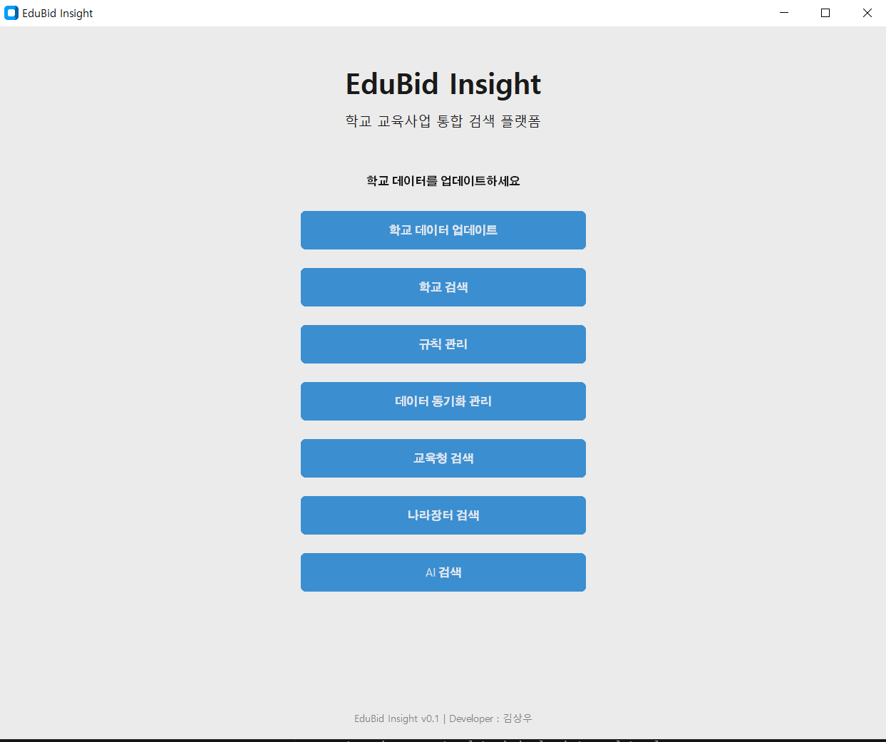
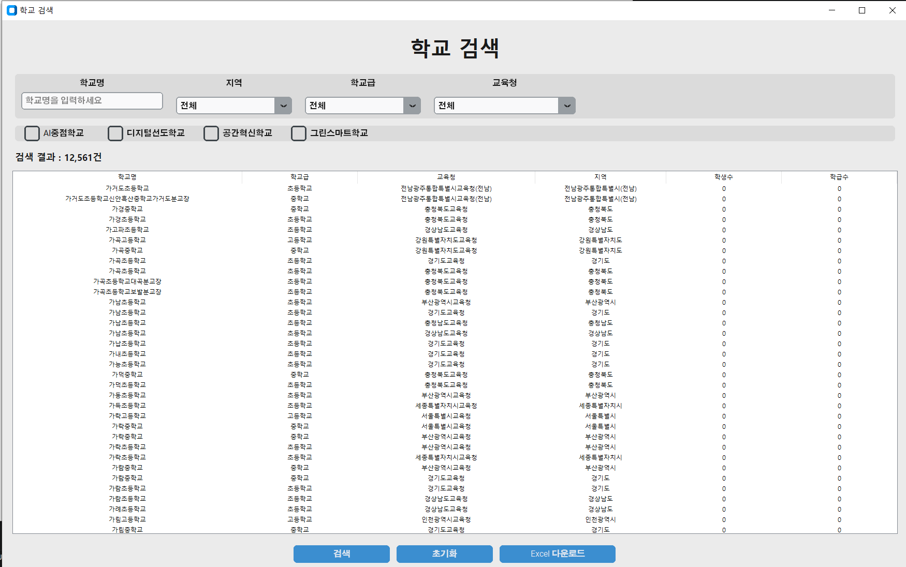
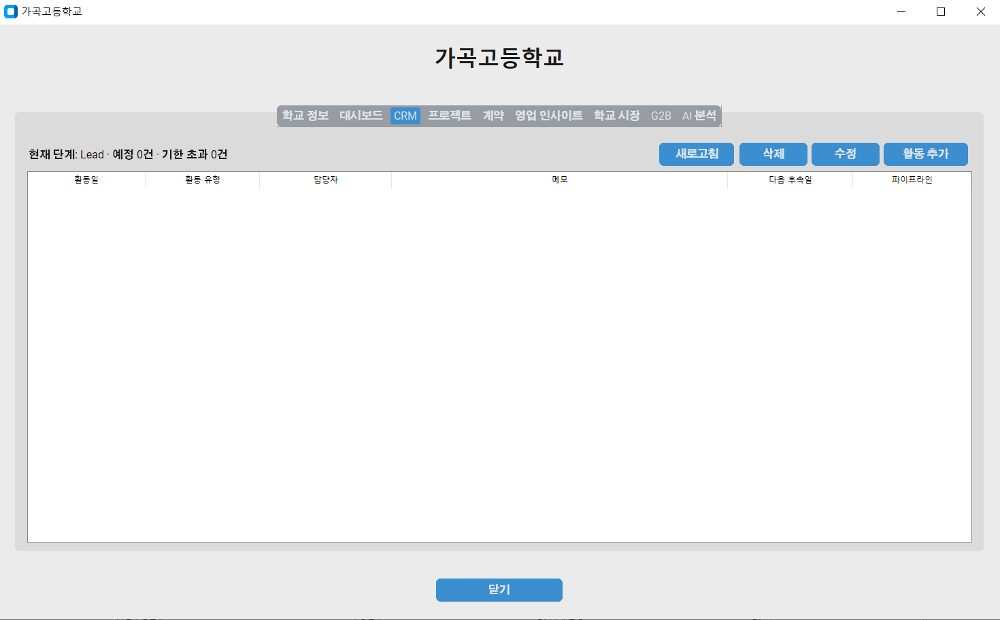
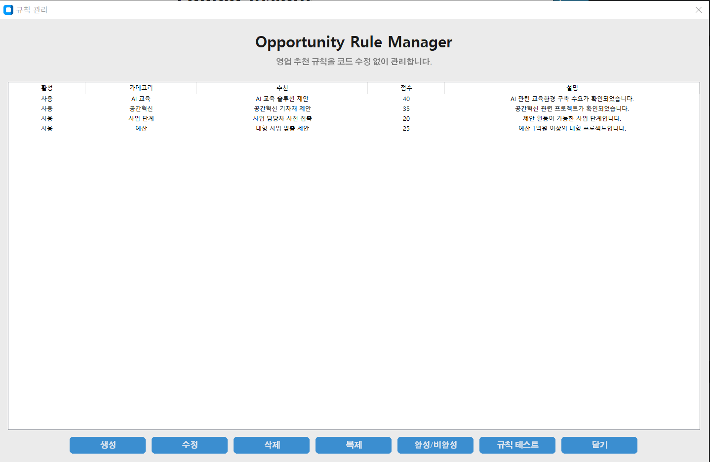

# 🎓 EduBid Insight

> **Education Sales Intelligence Platform**
>
> 학교 정보, 교육사업, 계약, CRM, 영업 인사이트를 하나의 플랫폼에서 관리하는 데스크톱 애플리케이션

---

## 📌 Overview

EduBid Insight는 학교 대상 영업을 위한 통합 관리 플랫폼입니다.

학교 검색부터 프로젝트 관리, 계약 관리, CRM, 영업 추천(Rule Engine), 데이터 분석까지 하나의 프로그램에서 수행할 수 있도록 설계되었습니다.

---

## ✨ Features

### 🏫 School Search

- 전국 초·중·고등학교 검색
- 지역 / 학교급 / 교육청 검색
- AI중점학교 검색
- 디지털선도학교 검색
- 공간혁신학교 검색
- 그린스마트학교 검색

---

### 📋 School Information

- 학교 기본정보
- 학생수
- 학급수
- 홈페이지
- 주소
- 교육청 정보

---

### 📂 Project Management

- 프로젝트 관리
- 사업 상태 관리
- 예산 관리
- 프로젝트 진행 현황

---

### 📑 Contract Management

- 계약 관리
- 계약 이력
- Excel Import
- CSV Import

---

### 📈 CRM

- 영업 활동 관리
- 파이프라인 관리
- Follow-up 일정
- KPI 관리

---

### 🧠 Opportunity Rule Engine

코드 수정 없이 영업 추천 규칙을 관리합니다.

예시

- AI 교육 솔루션 제안
- 공간혁신 기자재 제안
- 사업 담당자 사전 접촉
- 대형 프로젝트 추천

---

### 📊 Analytics Dashboard

- 학교 통계
- 계약 통계
- 제품 통계
- 공급업체 분석
- 구매주기 분석

---

### 🚀 Business Intelligence

- 영업 우선순위
- 추천 제품
- 위험 분석
- 다음 영업 액션 추천

---

## 📸 Screenshots

### Main



---

### School Search



---

### School Detail


---

### CRM



---

### Rule Manager



---

## 🏗 Architecture

```
                GUI

                 │

        ┌────────┴────────┐

 School Search      Rule Manager

        │

     Services

        │

  Sync / Analytics / CRM

        │

    SQLite Database

        │

 Business Intelligence
```

---

## 📁 Project Structure

```
EduBidInsight/

│

├── assets/
│   └── screenshots/

├── config/

├── core/

├── data/

├── gui/

├── logs/

├── output/

├── services/

├── templates/

├── tests/

│

├── app.py

├── README.md

└── requirements.txt
```

---

## 🚀 Quick Start

### Clone

```bash
git clone https://github.com/USERNAME/EduBidInsight.git
```

### Install

```bash
pip install -r requirements.txt
```

### Run

```bash
python app.py
```

---

## 🧪 Testing

Run all tests

```bash
python -m pytest
```

Current Status

```
46 Tests Passed
```

---

## 🛠 Technology Stack

- Python 3
- CustomTkinter
- SQLite
- OpenPyXL
- Pandas
- Pytest

---

## 🛣 Roadmap

### ✅ v1.0 Beta

- School Search
- Project Management
- Contract Management
- CRM
- Rule Engine
- Analytics
- Business Intelligence

---

### 🚧 v1.1

- School Market Import
- 나라장터 Import
- 교육청 사업 Import

---

### 🚧 v1.2

- AI Copilot
- Sales Forecast
- AI Recommendation
- Dashboard Upgrade

---

## 🤝 Contributing

Issues와 Pull Request를 환영합니다.

새로운 기능 제안이나 버그 리포트는 GitHub Issues를 이용해주세요.

---

## 📄 License

MIT License

---

## 👨‍💻 Developer

**김상우**

EduBid Insight Project

Education Sales Intelligence Platform